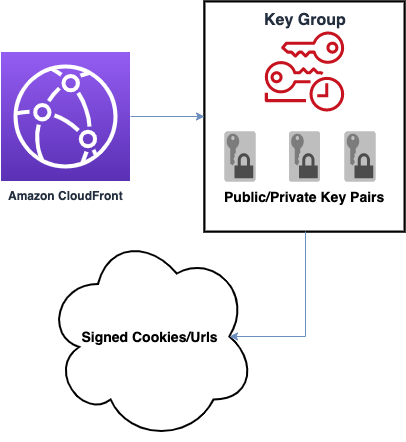

# aws-cloudfront-signed-key-pair module
<!--BEGIN STABILITY BANNER-->

---


> All classes are under active development and subject to non-backward compatible changes or removal in any
> future version. These are not subject to the [Semantic Versioning](https://semver.org/) model.
> This means that while you may use them, you may need to update your source code when upgrading to a newer version of this package.

---
<!--END STABILITY BANNER-->

| **Reference Documentation**:| <span style="font-weight: normal">https://docs.aws.amazon.com/solutions/latest/constructs/</span>|
|:-------------|:-------------|
<div style="height:8px"></div>

| **Language**     | **Package**        |
|:-------------|-----------------|
`aws_solutions_constructs.aws_cloudfront_s3`|
| Typescript|`@aws-solutions-constructs/aws-cloudfront-s3`|

This AWS Solutions Construct implements an AWS CloudFront Key Pair Construct with an auto-generated key pair that can produce Signed Cookies or Signed Urls for use in your CloudFront Distribution. 

The Construct also implements the IPublicKey interface so it can be easily included in a `KeyGroupProps.items` array of public keys.

Here is a minimal deployable pattern definition in Typescript:

``` typescript
import { SignedKeyPair } from '@aws-solutions-constructs/aws-cloudfront-signed-key-pair';

new SignedKeyPair(this, 'test-cloudfront-signed-key-pair', {
    url:'https:my-cloudfront-distribution.com'
});

```

## Initializer

``` text
new SignedKeyPair(scope: Construct, id: string, props: SignedKeyPairProps);
```

_Parameters_

* scope [`Construct`](https://docs.aws.amazon.com/cdk/api/latest/docs/@aws-cdk_core.Construct.html)
* id `string`
* props [`SignedKeyPairProps`](#pattern-construct-props)

## Pattern Construct Props

| **Name**     | **Type**        | **Description** |
|:-------------|:----------------|-----------------|
|url|[`string`]|The domain name or full uri to your CloudFront Distribution.|
|type|[`SignedKeyPairType`](/index.ts)|Whether to use Signed Cookies or Signed Urls with the Cloudfront Distribution|
|cloudFrontDistributionProps?|[`cloudfront.DistributionProps`](https://docs.aws.amazon.com/cdk/api/latest/docs/@aws-cdk_aws-cloudfront.DistributionProps.html)|Optional user provided props to override the default props for the CloudFront Distribution.|
|defaultBehaviorOptions?|[`cloudfront.BehaviorOptions`](https://docs.aws.amazon.com/cdk/api/latest/docs/@aws-cdk_aws-cloudfront.BehaviorOptions.html)|Optional user provided props to override the optional props of the signed cookie or url's default behavior|
|expires?|[`Date | string | number`]| The date or timestamp in which the signed cookie or signed url will expire *(defaults to one week)* |
|starts?|[`Date | string | number`]|The date or timestamp in which the signed cookie or signed url will start *(defaults to Date.now())* |
|ipAddress?|[`string`](https://docs.aws.amazon.com/AmazonCloudFront/latest/DeveloperGuide/private-content-setting-signed-cookie-custom-policy.html#private-content-custom-policy-statement-cookies-values)|The IP address of the client making the GET request|
|comment?|[`string`]|A comment to describe the signed key pair.
|
|signedKeyPairName?|[`string`]|A name to identify the signed key pair.
|
|keyPairOptions?|[`KeyPairOptions`](#key-pair-options))|Options to use to generate the public/private key pair|
|insertHttpSecurityHeaders?|`boolean`|Optional user provided props to turn on/off the automatic injection of best practice HTTP security headers in all responses from CloudFront|
|cookieOptions?|[`CookieOptions`](#cookie-options))|Options to use when creating signed cookies|

## Pattern Properties

| **Name**     | **Type**        | **Description** |
|:-------------|:----------------|-----------------|
|publicKeyId|[`string`]|The Id of the underlying `PublicKey` Construct|
|publicKey|[`cloudfront.PublicKey`]|The associated `PublicKey` Construct|
|signedUrl|[`string`]|The Url for the Cloudfront Distribution with the full Signed Url query params appended|
|signedCookies|['string`]|The signed cookies for use in headers formatted as a cookie string
|signedCookieHeaders|[`SignedCookieHeaders`](/index.ts)|The signed cookies formatted as headers for use in http calls outside of Lambda@Edge|
|edgeLambdaSignedCookieHeaders|[`SignedCookieEdgeHeaders`](/index.ts)|The signed cookies formatted as headers for use in http calls within a Lambda@Edge function|
|signature|[`string`]|The signature generated using the key pair's private key and the policy configured for signed cookies or urls|
|node|[`ConstructNode`](https://docs.aws.amazon.com/cdk/api/latest/docs/@aws-cdk_core.ConstructNode.html)|The construct tree node associated with the construct. Included to fulfill implementation of `IPublicKey` so it can be supplied as an `item` in a [`KeyGroup`](https://docs.aws.amazon.com/cdk/api/latest/docs/@aws-cdk_aws-cloudfront.KeyGroup.html)|
|env|[`ResourceEnvironment`](https://docs.aws.amazon.com/cdk/api/latest/docs/@aws-cdk_core.ResourceEnvironment.html)|The environment this resource belongs to. Included to fulfill implementation of `IPublicKey` so it can be supplied as an `item` in a [`KeyGroup`](https://docs.aws.amazon.com/cdk/api/latest/docs/@aws-cdk_aws-cloudfront.KeyGroup.html)|
|stack|[`Stack`](https://docs.aws.amazon.com/cdk/api/latest/docs/@aws-cdk_core.Stack.html)|The stack in which this resource is defined. Included to fulfill implementation of `IPublicKey` so it can be supplied as an `item` in a [`KeyGroup`](https://docs.aws.amazon.com/cdk/api/latest/docs/@aws-cdk_aws-cloudfront.KeyGroup.html)|


## Default settings

Out of the box implementation of the Construct without any override will set the following defaults:

### Amazon CloudFront
* Item 1
* Item 2

## Architecture


### Key Pair Options
Options to use when generating a public/private key pair. Uses [NodeJS crypto module](https://nodejs.org/docs/latest-v12.x/api/crypto.html#crypto_crypto_generatekeypair_type_options_callback)  

| **Name**     | **Type**        | **Description** | **Default**
|:-------------|:----------------|-----------------|-------------|
|type?|[`KeyObject.AsymmetricKeyType`](https://nodejs.org/docs/latest-v12.x/api/crypto.html#crypto_keyobject_asymmetrickeytype)|`rsa | dsa | ec | ed25519 | ed448 | x25519 | x448 | dh`|*`rsa`*|
|format?|[`string`](https://nodejs.org/docs/latest-v12.x/api/crypto.html#crypto_keyobject_export_options)|`pem | der`|*`pem`*|
|length?|[`number`]|Key size in bits (RSA, DSA)|*2048*|
|
|publicKeyType?|[`string`]|`spki | pkcs1 (RSA only)`|*`spki`*|
|privateKeyType?|[`string`]|`pkcs8 | pkcs1 (RSA only) | sec1 (EC only)`|*`pkcs8`*|
|cipher?|[`string`](https://nodejs.org/docs/latest-v12.x/api/crypto.html#crypto_keyobject_export_options)|If specified, the private key will be encrypted with the given cipher and passphrase using PKCS#5 v2.0 password based encryption.|*undefined*|
|passphrase?|[`string | Buffer`](https://nodejs.org/docs/latest-v12.x/api/crypto.html#crypto_keyobject_export_options)|The passphrase to use for encryption|*undefined*|


### Cookie Options
Options to use when creating [signed cookies](https://docs.aws.amazon.com/AmazonCloudFront/latest/DeveloperGuide/private-content-signed-cookies.html)  

| **Name**     | **Type**        | **Description** | **Default**
|:-------------|:----------------|-----------------|-------------|
|expires?|[`Date | number | string`]|Date or timestamp when cookie expires|*session*|
|maxAge?|[`Date | number | string`]|Date or timestamp reflecting maximum age of cookie. Only one of `expires` and `maxAge` can be set at a time|*undefined*|
|secure?|[`boolean`]|Requires that the viewer encrypt cookies before sending a request|*true*|
|
|httpOnly?|[`boolean`]|Requires that the viewer send the cookie only in HTTP or HTTPS requests|*false*|
|domain?|[`string`]|The domain name for the requested file.|*undefined*|
|path?|[`string`]|The path for the requested file|*`/`*|
|sameSite?|[`strict | lax | `none]|How to handle sending cookie along with same-site requests|*undefined*|


***
&copy; Copyright 2021 Amazon.com, Inc. or its affiliates. All Rights Reserved.